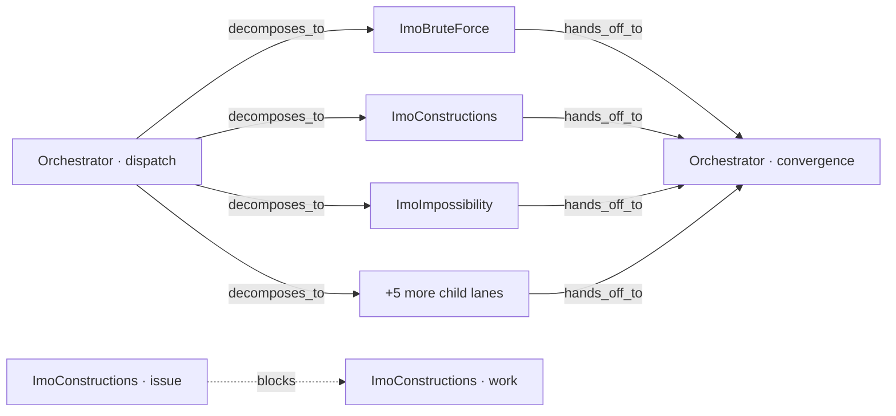

# HumanRL

**Was my prompt any good?** HumanRL answers that from the trace an agent left behind. Point it at a Codex or Claude session (or the bundled demo) and it shows, in plain English, what every tool call did, where the agent spawned subagents, whether each spawn was worth its tokens, and what in your prompt caused the waste.

It is built on [IntentTrace](https://github.com/chivier/IntentTrace), a local-first agent-observability workbench, and keeps everything IntentTrace has (append-only raw events, Intent Graph, Agent Gantt, replay slider, Evidence Inspector). Nothing leaves your machine.


## One command

```bash
git clone https://github.com/SecretSettler/HumanRL.git && cd HumanRL
corepack enable && corepack pnpm install --frozen-lockfile
corepack pnpm humanrl:up
```

`humanrl:up` starts PostgreSQL, migrates, runs the API, worker and web, loads the demo trace, prints the URL and opens it. With Docker Compose installed it runs the containerised stack IntentTrace ships; without it (no compose plugin, or a Docker daemon out of disk) it runs the services on the host and finds PostgreSQL from `docker run`, from Homebrew `postgresql@17`, or from an existing `DATABASE_URL`. `pnpm humanrl:down` stops everything it started; `pnpm humanrl:status` says what is running. Logs are under `.intenttrace/logs/`.

You need Node 24 (22 works with a warning) and pnpm 11 via Corepack.

## Bring your own session

```bash
# the most recent Codex session on this machine
pnpm humanrl:import -- --source codex --path ~/.codex/sessions --newest --max-files 1

# the three most recent Claude Code sessions
pnpm humanrl:import -- --source claude --path ~/.claude/projects --newest --max-files 3

# or pick by hand: list, copy an id, import it
pnpm humanrl:import -- discover --source codex --path ~/.codex/sessions --limit 20
pnpm humanrl:import -- --source codex --path ~/.codex/sessions --session <24-char id>
```

Then open `http://127.0.0.1:3000/traces` and pick the trace. The browser `/import` page does the same with drag and drop. Imports strip hidden reasoning, encrypted content and host paths before anything is stored (see [Importing traces](#importing-traces) below).

## How to read the page

**Execution story** (left) is the run as a list you can read top to bottom:

- `▸ User request` is your prompt. `… Agent said` is what the agent told you between actions.
- `✓ read ×4 · Reading parallel dispatch skill +3` is one agent running one tool four times in a row. Click it to see the four calls; click a call to open its raw event and sanitized payload in the Evidence Inspector on the right. `!` means a call failed.
- `⑂ spawn · Orchestrator → 3 child agents · Paid off` is a handoff to subagents, with its verdict.
- `⇤ ImoBruteForce finished, joined by Orchestrator` is a child coming back.
- The left border colour is the agent's lane, the same colour as in the Gantt below.

**Prompt review** (right, top) shows the prompt you sent and one finding per thing it caused. `Fix` is money left on the table, `Improve` is a habit, `Note` is context. Each finding has **Show evidence**, which opens the raw event behind it.

**Prompt optimizer** says whether the root agent should spawn a subagent _now_ at the current replay position, and the **spawn ledger** rates every spawn that already happened. Drag the watermark slider under the panel and everything replays: before the first spawn the verdict is Hold with no signals, mid-run it is Hold because children are still out, at the end it is a post-mortem.

## Two real runs

**The bundled demo** is a recorded run where an orchestrator solved IMO 2025 P1 with eight parallel subagents (691 events, 9 lanes). The prompt was one Chinese sentence: _"use subagents to solve an IMO problem, make sure to use skills + subagents concurrently, make the trace real and complex."_ The review says:

|         | Finding                                                                                                    | What it means for the prompt                                                                                                                                              |
| ------- | ---------------------------------------------------------------------------------------------------------- | ------------------------------------------------------------------------------------------------------------------------------------------------------------------------- |
| Fix     | Agents reached for 3 tools that do not exist: `eval`, `write` and `bash` (5 failed calls in 2 lanes)       | The prompt implied machine verification; the environment had no code runner. Say which tools exist.                                                                       |
| Improve | Prompt is ~69 tokens; the orchestrator wrote ~2,400 tokens of task assignments to fill in what it left out | Show evidence opens assignment #29: deliverable path, slice, constraints, stop rule, all written by the orchestrator. That text is the prompt that should have been sent. |
| Note    | 78% of the delegated work went to "Scouting UI, ingest, docs conventions"                                  | The prompt's first sentence about screenshots pulled three of eight agents onto the repo instead of the maths. A side quest deserves its own prompt.                      |
| Improve | 4 actions repeated in more than one lane                                                                   | Two scouts both read the screenshot script; the slices overlapped.                                                                                                        |
| Note    | The orchestrator took 14 turns after the last child joined                                                 | Assembly happened in its heaviest context.                                                                                                                                |
| Note    | Delegation paid off: 3 waves, 8 agents, net ≥41k tokens kept out of the orchestrator                       | The parallel structure itself was right.                                                                                                                                  |

**The Codex session that built this repository** (imported with the command above) is the other kind of run: one agent, no subagents, 45 `exec` calls. The story collapses to "user asked → agent said what it would do → 8 commands → agent reported → 14 commands → …", each `exec` shown as the shell command it ran rather than the JavaScript wrapper Codex records. The review has one note: _Everything ran in one context: 45 tool calls, 48 turns, no subagent_, with the observation that the two repository reads were independent and a scout per repo would have kept their output out of the main context.


## What the prompt review checks

[`apps/web/lib/workbench/prompt-review.ts`](apps/web/lib/workbench/prompt-review.ts) produces one finding per pattern, each with the events as evidence:

| Finding                     | Trigger                                                                                 | What to change in the prompt                                    |
| --------------------------- | --------------------------------------------------------------------------------------- | --------------------------------------------------------------- |
| Missing tools (Fix)         | tool results that say "not found"                                                       | name the tools that exist, or drop that expectation             |
| Prompt too thin (Improve)   | the orchestrator's task assignments are ≥3× the size of the prompt                      | write the deliverable, slices, constraints and stop rule        |
| Poor spawn (Improve)        | a wave rated Marginal or Wasted                                                         | delegate only independent, heavy work                           |
| Dominant wave (Note)        | one wave ≥60% of all delegated work                                                     | split side quests into their own prompt                         |
| Overlapping lanes (Improve) | the same read/grep action in more than one lane (control tools such as `yield` ignored) | partition the work or share the context in each assignment      |
| Post-join assembly (Note)   | more than eight orchestrator turns after the last child joined                          | ask for a writeup or verifier agent                             |
| No delegation (Note)        | twenty or more tool calls in one context and no subagent                                | say which parts are independent and ask for a subagent per part |
| Delegation paid off (Note)  | every wave rated Paid off                                                               | keep the structure                                              |

Everything is derived from event metadata (kind, name, status, agent, attributes). The only prompt body ever loaded is your own, fetched from the sanitized payload so the page can show it. Harness-injected messages (AGENTS.md, environment context, skill catalogues) are recognised by shape and skipped.

## How the optimizer decides

Both rules live in [`apps/web/lib/workbench/prompt-optimizer.ts`](apps/web/lib/workbench/prompt-optimizer.ts) and are unit-tested against fixture-shaped events.

**Spawn now or hold (prospective).** A child lane is only worth its fresh context when the root lane shows an evidence gap or context pressure: tool failures (isolate the investigation), repeated identical tool calls (the root is looping), or more than six model turns already accumulated. The expected saving from those signals is compared with the cost of one child (fixed overhead plus a restated task). The verdict is always `Hold` while children are still running (wait for the join, do not double-spawn) and once the trace is complete.

**Was that spawn worth it (retrospective).** For each `agent_handoff`, the child lanes' tool results and model turns are what stayed out of the parent's context; that volume is the saving. The children's fixed context plus their task assignments is the cost. Net ≥ cost is Paid off, net ≥ 0 is Marginal, negative is Wasted, and a handoff with no child started yet is Pending.

All token figures are floors estimated from event counts, name lengths and payload sizes (CJK counted at one token per character); they are for comparison, not billing. Adapters that do not record `model_call` events (Codex) get their turn count from narrated assistant messages plus tool calls.

The story derivation (name parsing, FIFO result pairing inside a lane, step grouping, Codex `exec` command extraction) is in [`apps/web/lib/workbench/execution-story.ts`](apps/web/lib/workbench/execution-story.ts); the UI is [`apps/web/components/workbench/ExecutionStoryPanel.tsx`](apps/web/components/workbench/ExecutionStoryPanel.tsx).

## Running it by hand

`pnpm humanrl:up` is the whole of the above in one command. The IntentTrace Docker path (`pnpm docker:up`, `pnpm demo:load`) is unchanged, and the host-run steps are what the script does:

```bash
corepack pnpm --filter './packages/*' build
set -a; source .env.example; set +a          # DATABASE_URL points at 127.0.0.1:15432
corepack pnpm --filter @intenttrace/db migrate
corepack pnpm --filter @intenttrace/api dev &
corepack pnpm --filter @intenttrace/worker dev &
corepack pnpm --filter @intenttrace/web dev --hostname 127.0.0.1 --port 3000 &
INTENTTRACE_WEB_ORIGIN=http://127.0.0.1:3000 corepack pnpm demo:load
```

## Acknowledgements

HumanRL exists because of **[IntentTrace](https://github.com/chivier/IntentTrace)** by **[Chivier Humber](https://github.com/chivier)**. The append-only event model, the Codex/Claude/OpenCode/OMP/Grok adapters, the deterministic reducer behind the Intent Graph, the Agent Gantt, the replay watermark and the Evidence Inspector are all IntentTrace's work, vendored here unchanged from commit [`5de3e42`](https://github.com/chivier/IntentTrace/commit/5de3e428e36c3b1286bd069edd32ac75742aed7a). HumanRL adds the Execution story, the prompt review and the spawn accounting on top, and nothing in this repository would render without the foundation underneath it.

IntentTrace is © 2026 Chivier Humber, released under the GNU Affero General Public License v3.0 only; HumanRL is a derivative work under the same licence (see [`LICENSE`](LICENSE) and [`NOTICE`](NOTICE)). If you find the trace model useful, star and cite the upstream project; bugs in the panel described above belong here, bugs in the adapters, reducer or API belong upstream.

IntentTrace's own README follows.

---

English | [简体中文](README.zh-CN.md)

[](https://github.com/chivier/IntentTrace/actions/workflows/ci.yml)
[](LICENSE)
[](.node-version)
[](docs/contracts/api/openapi.yaml)

IntentTrace is a local-first agent-observability workbench that turns multi-agent execution traces into a replayable, evidence-backed intent graph while keeping every raw execution event as an immutable, append-only fact.

The raw layer is the record; the semantic layer is derived from it. A model may only propose a patch, and a deterministic reducer decides whether that patch becomes a revision. Nothing leaves the machine by default: the whole stack sits behind a single loopback port, and the semantic pipeline ships with a deterministic mock provider, so the graph can be built with no cloud model at all.

> [!WARNING]
> **Project stage: Local MVP.** IntentTrace targets a single developer-controlled host: no authentication, not multi-tenant, not highly available, and the only host entry point is bound to `127.0.0.1`. Cloud models are off by default, and the mock semantic pipeline runs in a fully offline environment.


The screenshots in this README — the workbench above and the [trace list](docs/assets/trace-list.png) — are captured from the recorded demo trace described in [Demo: nine lanes, one olympiad problem](#demo-nine-lanes-one-olympiad-problem): a real agent run, redacted at record time. Reproduce them with `pnpm screenshots:readme` once the stack is up and `pnpm demo:load` has run; the script serves only the demo trace, so other local traces cannot enter a screenshot.

## Why IntentTrace

- **Raw facts are immutable.** Raw execution events are append-only and are never overwritten by model output. See [system invariants](docs/architecture.md#system-invariants).
- **Semantic conclusions stay traceable.** Every claim resolves back to a raw event or to artifact evidence. See [the artifact and evidence contract](docs/contracts.md#artifact-and-evidence-contract).
- **Replay against the information available then.** Graph, Gantt, raw events and evidence share one ingest watermark. See [data flow](docs/architecture.md#data-flow-and-ordering).
- **A deterministic commit boundary.** The model only proposes; Zod validation and a deterministic reducer decide whether a revision is committed. See [the reducer contract](docs/contracts.md#reducer-contract).
- **Several ways in.** Canonical JSONL, OTLP HTTP JSON/gzip, Codex, Claude, OpenCode, OMP and Grok bundles from explicitly chosen bytes. Pi traces are accepted only in canonical event form; there is no Pi transcript parser.
- **Human revisions.** Edit, pin and feedback, with an immutable revision history preserved. See [the revision model](docs/contracts.md#revision-model).

## Quick start

Requirements:

- Linux x86_64 (the currently verified Compose target)
- Node.js `24.18.1` with Corepack
- pnpm `11.18.0`
- Docker Engine and Docker Compose v2

macOS 12+ can run the stack through Docker Desktop; the Tauri DMG still needs Apple codesigning and notarization before it counts as a distribution artifact. Windows is not a verified platform.

```bash
corepack enable
corepack prepare pnpm@11.18.0 --activate
pnpm install --frozen-lockfile
pnpm docker:up
pnpm demo:load
pnpm docker:url
```

Open the `/traces` page at the origin that `pnpm docker:url` prints. `demo:load` replays a recorded real agent run of 691 events; ingestion is content-addressed, so re-running it inserts nothing new. The fixed-seed synthetic acceptance fixture is still one command away: `pnpm demo:load:synthetic`.

Only Web is published, on an automatically allocated `127.0.0.1` ephemeral port; the API, PostgreSQL and the worker are reachable only inside the Compose private network. The whole stack is two images: `postgres`, plus one application image shared by the api, worker, web and migrate services. When a stable Web port is required:

```bash
INTENTTRACE_WEB_PORT=13000 pnpm docker:up
```

Everyday operations:

```bash
pnpm docker:status   # service health
pnpm docker:url      # current dynamic Web address
pnpm docker:down     # stop services, keep named volumes
```

These commands target the root `docker-compose.yml`; direct Docker Compose commands remain available when needed.

## Repository navigation

| Need                       | Go to                                                                                                            |
| -------------------------- | ---------------------------------------------------------------------------------------------------------------- |
| Start or develop           | [`docs/development.md`](docs/development.md)                                                                     |
| Architecture and data flow | [`docs/architecture.md`](docs/architecture.md)                                                                   |
| API and domain contracts   | [`docs/contracts.md`](docs/contracts.md), [`docs/contracts/api/`](docs/contracts/api/)                           |
| Persistence and migrations | [`docs/database.md`](docs/database.md), [`packages/db/migrations/`](packages/db/migrations/)                     |
| Operations and recovery    | [`docs/operations.md`](docs/operations.md), [`docs/operations/`](docs/operations/)                               |
| Quality gates              | [`docs/testing.md`](docs/testing.md)                                                                             |
| Status and evidence        | [`docs/project/progress.md`](docs/project/progress.md), [`docs/project/readiness.md`](docs/project/readiness.md) |
| Demos and screenshots      | [`scripts/demo/`](scripts/demo/)                                                                                 |
| Checks and maintenance     | [`scripts/checks/`](scripts/checks/), [`scripts/data/`](scripts/data/), [`scripts/ops/`](scripts/ops/)           |
| Runtime apps               | [`apps/`](apps/)                                                                                                 |
| Shared capabilities        | [`packages/`](packages/)                                                                                         |

## Demo: nine lanes, one olympiad problem

`pnpm demo:load` replays a recording of a real run: one orchestrator and eight parallel child agents solving and instrumenting IMO 2025 Problem 1 — 691 raw events, nine agent lanes, eight canonical spawn facts, and eight canonical join facts. It is a recording, not a simulation. Every event comes from the verified root transcript and its eight required child transcripts; the deterministic recorder drops hidden reasoning, signatures, and system prompts, rewrites host paths to `~`, bounds payloads, validates every event against the canonical schema, and never falls back to synthetic data.

The run went wrong in a way a chat log hides well. Three specialists — constructions, impossibility, verification — had no `eval`, `write` or `bash` tool, so they could not run a single check; they said so, continued by hand, and the orchestrator executed their scripts instead. The final answer (`k ∈ {0, 1, 3}`) is correct, which is exactly why the interesting question is _which agent's claim is actually backed by evidence_.

Open the trace and read it top-down:

1. **Agent Gantt** — nine lanes, with all eight child lanes tied to explicit parentage. That is the parallelism itself, not a description of it.
2. **Intent Graph** — the shape below is derived, not drawn by hand. The reducer reads the recorded spawn/join facts and emits 19 audited edges: eight `decomposes_to`, eight `hands_off_to` and three `blocks`. Every one carries the raw events it came from and `stated` provenance.



One dispatch node fans out to six child lanes and a second to the remaining two; convergence mirrors that as 5 + 3. The three `blocks` edges are not decoration — they land on exactly `ImoConstructions`, `ImoImpossibility` and `ImoVerifier`, the three specialists that had no `eval`, `write` or `bash` tool. The missing capability is a queryable edge, not a sentence buried in a log.

3. **Evidence inspector** — select a node: every claim lists the raw events it came from with `#ingestSeq`, kind and agent, and `Open sanitized source payload` serves the stored tool arguments or output behind it.
4. **Replay controls** — drag `Known at ingest watermark` back to 100 and the panels answer what was known then: `Raw Events` drops to 100 facts, the `eval` failure still cites `#50`, and the closing result node's evidence rows read `outside playhead` — the conclusion is on screen, the facts supporting it had not arrived yet.
5. **Raw Events** — 691 immutable facts. The graph is derived from them; nothing above can rewrite them.

A provider never proposes any of these edges. It returns node semantics only — `kind`, `title`, `claims` — and the deterministic reducer derives the structure, so a hallucinating model cannot invent a parent or a handoff. The reserved edge names in `SemanticEdgeKindSchema` (`attempts`, `supports`, `resolved_by`, `revises`, `supersedes`) have no derivation rule and therefore never appear.

The two screenshots above come from exactly this trace.

## Importing traces

Two entry points, one boundary: nothing is read until you hand the bytes over explicitly, and no server-side component ever enumerates a directory.

**From the browser.** Open `/import` and drop files, pick files, or pick a folder. IntentTrace reads only the first 64 KiB of each candidate to detect its source, title and project hint, ranks at most 50 candidates by modification time, and flags the ones already imported. Prompt previews stay hidden until you turn them on. Uploads are capped by `IMPORT_UPLOAD_MAX_BYTES`, 64 MiB by default.

**From the CLI**, for headless and bulk imports. Discovery sends nothing to the API and prints no paths, file names or native session IDs; you copy an opaque catalog ID out of it and import that:

```bash
WEB_ORIGIN="$(pnpm --silent docker:url | awk '/IntentTrace Web:/ { print $3 }')"

# 1. Discover recent sessions
pnpm --filter @intenttrace/collector dev discover \
  --source codex --path ~/.codex/sessions --limit 50

# 2. Import the ones you chose; --session may be repeated
pnpm --filter @intenttrace/collector dev import \
  --source codex --path ~/.codex/sessions \
  --session "paste-24-character-catalog-id" --api "$WEB_ORIGIN"
```

Both paths run the same whole-file adapter and Zod preflight before the first raw fact is sent, drop the same content at the adapter level (Codex `reasoning` and `encrypted_content` blocks, Claude `thinking` and `redacted_thinking` blocks, system instructions, and internal world-state and file-history snapshots), and derive the same content-hash completion marker, so a browser import and a CLI import of the same file are mutually idempotent. The opaque catalog ID scheme, the `O_NOFOLLOW` preflight, the 64 MiB per-file default and `--max-file-mib`, the loopback-only `--api` restriction, the bulk flags (`--newest`, `--max-files`, `--concurrency`, `--dry-run`) and the `--include-previews` consent flag are documented in [the import experience research](docs/design/research/import-experience.md#intenttrace-目标体验) and in [data handling](docs/security.md#data-handling).

## Architecture

```text
Explicit files / browser upload / OTLP
        │
        ▼
Adapters ──► Web loopback proxy ──► API ──► PostgreSQL raw facts
                                      │              │
                                      │              └─► durable SSE/outbox
                                      ▼
                             summary_jobs worker
                                      │
                         proposal → Zod → reducer
                                      │
                                      ▼
                          immutable semantic revisions
                                      │
                                      ▼
                        Graph / Gantt / Evidence UI
```

Core boundaries:

1. Zod schemas are the authoring source for domain contracts; the Drizzle schema and its migrations are the persistence source.
2. A raw event is an append-only fact; the semantic graph is revisioned derived data.
3. User intent, agent intention, observed action and outcome are modelled separately.
4. A provider returns only proposals; a deterministic reducer validates and commits them.
5. The system does not reconstruct, store or display hidden chain-of-thought.

Details: [architecture overview](docs/architecture.md#architecture-overview), [data flow and ordering](docs/architecture.md#data-flow-and-ordering), [ADR index](docs/decisions.md#adr-index).

## Documentation

| Document                                               | Covers                                                          |
| ------------------------------------------------------ | --------------------------------------------------------------- |
| [`docs/architecture.md`](docs/architecture.md)         | Overview, system invariants, data flow and ordering             |
| [`docs/decisions.md`](docs/decisions.md)               | All 14 ADRs and the ADR index                                   |
| [`docs/contracts.md`](docs/contracts.md)               | Domain model, idempotency, reducer, artifact, adapter contracts |
| [`docs/contracts/api.md`](docs/contracts/api.md)       | API design, error codes, SSE protocol, generated OpenAPI        |
| [`docs/security.md`](docs/security.md)                 | Threat model, data handling, provider egress policy             |
| [`docs/operations.md`](docs/operations.md)             | Deployment, observability, backup and restore, macOS shell      |
| [`docs/development.md`](docs/development.md)           | Environment, contribution flow, repository guide, gates         |
| [`docs/reference.md`](docs/reference.md)               | Every configuration key, and the glossary                       |
| [`docs/project/progress.md`](docs/project/progress.md) | Progress with commands, commits and environment evidence        |

Full navigation, including testing, database, product spec and research notes: [`docs/README.md`](docs/README.md).

> [!NOTE]
> `docs/` is in English, except the project records under `docs/project/` and the design and research notes under `docs/design/`, which are still in Chinese.

## Telemetry and data egress

**IntentTrace's own code collects no telemetry.** There is no analytics client, crash reporter or usage ping anywhere in the tree, and IntentTrace itself reports nothing at install, start or run time.

**Its build tools do ship telemetry, enabled by default, and the stack disables it.** `pnpm build` is `turbo run build`, so `NEXT_TELEMETRY_DISABLED=1` and `TURBO_TELEMETRY_DISABLED=1` are set in `infra/Dockerfile`, `docker-compose.yml` and the CI workflow — the quick start above therefore sends nothing to Vercel. Running `pnpm build`, `pnpm dev` or `pnpm typecheck` on the host instead of through Docker is subject to both vendors' defaults; export the same two variables to opt out there too. See [data handling](docs/security.md#data-handling) for the vendors' own opt-out commands and their caveat.

**Cloud provider egress is off by default.** `PROVIDER_MODE` defaults to `mock` and `PROVIDER_EGRESS_ENABLED` defaults to `false`, which is also what the test suite runs against.

Selecting `PROVIDER_MODE=openai` or `PROVIDER_MODE=deepseek` makes configuration loading fail unless every gate is satisfied at once: `PROVIDER_EGRESS_ENABLED=true`, a positive `PROVIDER_DAILY_BUDGET_USD` (default `0`), an API key, an explicit model, and a base URL whose host is exactly `api.openai.com` or `api.deepseek.com`. Only then may the worker send a deterministic event sketch, truncated to `PROVIDER_MAX_EVENTS` events (default `256`) and redacted, under a `PROVIDER_TIMEOUT_MS` timeout (default `30000`). Source text, complete documents, whole terminal logs, environment variables, credentials and absolute user paths are never sent; provider responses are treated as untrusted input; and a timeout, an HTTP 429, an exhausted budget or malformed JSON falls back to the raw-only path rather than to another provider. Prompt and response bodies are never persisted — only the model, hashes, token counts, cost and a redaction report are.

The full boundary is in [security](docs/security.md#provider-egress-policy); every configuration key and its default is in [reference](docs/reference.md#configuration-reference).

## Current limitations

- The release boundary is a local single-host MVP: no auth or RBAC, no multi-tenancy, no HA, no public SaaS.
- The OpenAI and DeepSeek adapters are implemented, but real-provider quality and cost have not completed public release qualification.
- Performance figures are synthetic smoke tests and single-host observations, not a production SLA.
- The macOS universal DMG workflow exists, but a real artifact still needs Apple signing, notarization and install verification.
- OTLP gRPC, run comparison and mobile clients remain out of scope.

Strict evidence for what is implemented, verified or blocked: [`docs/project/progress.md`](docs/project/progress.md) and [`docs/project/readiness.md`](docs/project/readiness.md#发布就绪).

## Community and support

- **Bug reports and feature requests** — [GitHub Issues](https://github.com/chivier/IntentTrace/issues). Best for: reproducible defects and scoped proposals with an expected-versus-actual description.
- **Usage questions** — [the support guide](.github/SUPPORT.md). Best for: setup, Docker and import problems that are not defects.
- **Security reports** — follow the [security policy](.github/SECURITY.md) and report privately; never open a public issue. Best for: anything that weakens the boundaries described in [security](docs/security.md#threat-model).

Never paste API keys, real trace payloads, session logs or private source code into a public issue.

## Contributing

Bug reports, documentation improvements, adapter fixtures, accessibility fixes and small pull requests are welcome. A behavioural or contract change must update the schema, migration, OpenAPI, tests and docs together, and model output must never overwrite raw facts. Contributions are offered under the project licence, declared with `git commit -s` (Developer Certificate of Origin 1.1).

Start with [the contributor guide](.github/CONTRIBUTING.md), [the contribution flow](docs/development.md#contribution-flow), and [the repository guide](docs/development.md#repository-guide). The mandatory local and CI gate sequence is listed in [quality and release process](docs/development.md#quality-and-release-process).

## License

IntentTrace is licensed under the [GNU Affero General Public License v3.0 only](LICENSE) (SPDX: `AGPL-3.0-only`). If you modify IntentTrace and offer it to users over a network, AGPL section 13 requires you to offer those users the corresponding source. Third-party dependencies and the self-hosted Inter font keep their own licences; review [`THIRD_PARTY_NOTICES.md`](THIRD_PARTY_NOTICES.md) and the matching dependency licence texts before distributing or deploying.
