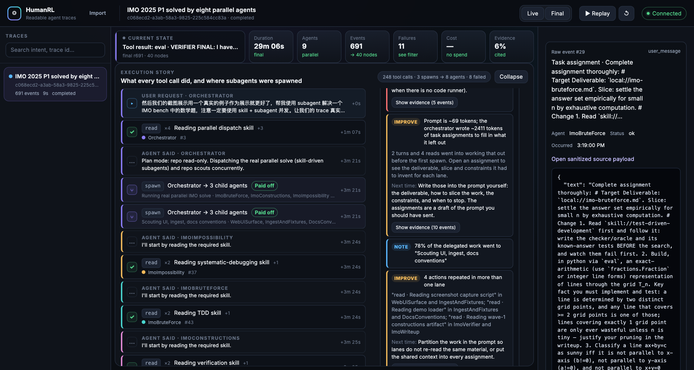
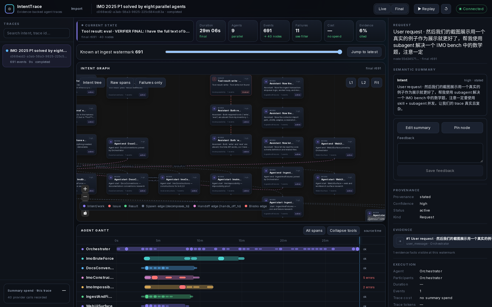
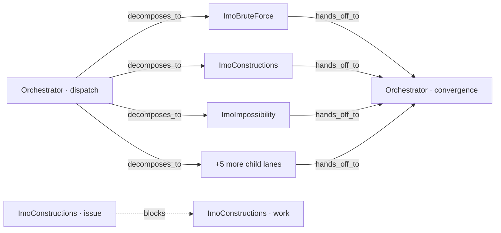

# HumanRL

HumanRL 给用 Codex 或 Claude Code 的人看自己的 prompt 写得怎么样。把一个 session（或自带的 demo）导进去，它按 trace 列出：每次 tool call 干了什么、agent 在哪里 spawn 了子 agent、每次 spawn 值不值那些 token，以及 prompt 里哪句话造成了浪费。界面是英文的。

它建在 [IntentTrace](https://github.com/chivier/IntentTrace) 上，保留 IntentTrace 的全部功能（只追加的 raw event、Intent Graph、Agent Gantt、回放滑块、Evidence Inspector），数据不出本机。



## 安装

```bash
curl -fsSL https://raw.githubusercontent.com/SecretSettler/HumanRL/main/install.sh | bash
```

这一行把仓库 clone 到 `~/HumanRL`、装依赖、把 `humanrl` 命令放进 PATH、启动 PostgreSQL、api、worker、web，导入 demo trace，然后在浏览器里打开。事先只需要 `git` 和 Node.js（推荐 24，22 能跑）；缺哪个，脚本会说。

## 用法

```bash
humanrl codex        # 导入你最近一次 Codex session 并打开
humanrl claude       # 最近一次 Claude Code session
humanrl claude 3     # 最近三次
humanrl              # 打开 demo（没起的话先起）
humanrl status       # 在不在跑，以及你有哪些 trace
humanrl stop
```

`humanrl import <文件或目录>` 导入任意 session。来源按路径猜，猜不到就加 `--source codex|claude|opencode|omp|grok`。Codex 从 `~/.codex/sessions` 读，Claude Code 从 `~/.claude/projects` 读，`HUMANRL_CODEX_DIR` / `HUMANRL_CLAUDE_DIR` 可以改。超过 64 MiB 的 session 会跳过并提示。导入时会去掉隐藏推理、加密内容和主机路径，再写库。

在仓库目录里同样的命令是 `pnpm humanrl codex`、`pnpm humanrl stop` 等。PostgreSQL 依次尝试 Docker Compose、`docker run`、Homebrew 的 `postgresql@17`、已有的 `DATABASE_URL`。日志在 `.intenttrace/logs/`。`HUMANRL_DIR` 改 clone 位置，`HUMANRL_NO_OPEN=1` 不开浏览器。

## 页面怎么看

**Execution story**（左）是一条从上往下读的运行记录：

- `▸ User request` 是你的 prompt，`… Agent said` 是 agent 在动作之间跟你说的话。
- `✓ read ×4 · Reading parallel dispatch skill +3` 是一个 agent 连续用同一个工具四次。点一下展开四次调用，再点单次调用，右边 Evidence Inspector 打开它的原始事件和 sanitized payload。`!` 表示失败。
- `⑂ spawn · Orchestrator → 3 child agents · Paid off` 是一次派发子 agent，带结论。
- `⇤ ImoBruteForce finished, joined by Orchestrator` 是子 agent 回来了。
- 左边框颜色是 agent 的 lane，和下面 Gantt 同色。

**Prompt review**（右上）显示你发的 prompt 和它造成的每一件事。`Fix` 是实际浪费了 token 的问题，`Improve` 是可以改的写法，`Note` 是背景信息。每条都有 **Show evidence**，直接打开背后的原始事件。

**Prompt optimizer** 回答“在当前回放位置，根 agent 现在该不该 spawn”，**spawn ledger** 给已经发生的每次 spawn 打分。拖面板下面的 watermark 滑块，整个面板跟着回放：第一次 spawn 之前是 Hold（没信号），中途是 Hold（子 agent 还没回来），结束后是复盘。

## 两个真实的例子

**自带的 demo** 是一次录下来的运行：orchestrator 用八个并行子 agent 解 IMO 2025 P1（691 事件，9 个 lane）。prompt 只有一句中文：“帮我使用 subagent 解决一个 IMO bench 中的数学题，注意一定要使用 skill + subagent 并发，让 trace 真实且复杂。” review 给出：

|         | 发现                                                                            | 对 prompt 意味着什么                                                                                          |
| ------- | ------------------------------------------------------------------------------- | ------------------------------------------------------------------------------------------------------------- |
| Fix     | agent 去调了 3 个不存在的工具：`eval`、`write`、`bash`（2 个 lane 里 5 次失败） | prompt 暗示要机器验证，环境里没有代码运行器。写清楚有哪些工具。                                               |
| Improve | prompt 约 69 token，orchestrator 自己写了约 2400 token 的任务分配来补它没说的   | Show evidence 打开 #29：交付路径、切片、约束、停止条件都是 orchestrator 自己写的。那段文字才是该发的 prompt。 |
| Note    | 78% 的委派工作给了 "Scouting UI, ingest, docs conventions"                      | prompt 第一句关于截图的话把八个 agent 里的三个拉去看仓库而不是做数学。支线该单独开一个 prompt。               |
| Improve | 4 个动作在多个 lane 重复                                                        | 两个 scout 都读了截图脚本，切片有重叠。                                                                       |
| Note    | 最后一个子 agent 回来后 orchestrator 又跑了 14 轮                               | 组装发生在它最重的上下文里。                                                                                  |
| Note    | 委派划算：3 波、8 个 agent，净省 ≥41k token 没进 orchestrator 上下文            | 并行结构本身是对的。                                                                                          |

**搭这个仓库的那次 Codex session**（当时用 `humanrl codex` 导入）是另一种运行：单 agent、没有子 agent、45 次 `exec`。记录压成“用户提问 → agent 说打算怎么做 → 8 条命令 → agent 汇报 → 14 条命令 → …”，每次 `exec` 显示它跑的 shell 命令，而不是 Codex 记录的 JavaScript 外壳。review 只有一条 note：_Everything ran in one context: 45 tool calls, 48 turns, no subagent_，指出两个仓库的阅读是独立的，一个仓库一个 scout 就能把那些输出挡在主上下文外。


**一次 Claude Code session**（`humanrl claude`）读法一样：每次 Bash 调用显示 Claude Code 给它写的描述（"Read full memory notes on the multi-agent study"），WebSearch / WebFetch 显示查询词或 URL。展开一步再点单次调用，右边打开原始事件和 sanitized 的工具输入。


## 判断规则

Prompt review 的八条检查规则见英文 README 里的表格，代码在 [`apps/web/lib/workbench/prompt-review.ts`](apps/web/lib/workbench/prompt-review.ts)。优化器的两条规则在 [`apps/web/lib/workbench/prompt-optimizer.ts`](apps/web/lib/workbench/prompt-optimizer.ts)：

**现在 spawn 还是 hold（前瞻）。** 只有根 lane 出现证据缺口或上下文压力时，子 Agent 的新上下文才划算：工具失败（把排查隔离出去）、重复的相同工具调用（根 Agent 在打转）、或者已经累计超过六轮 model call。这些信号折算的预计节省，和一个子 Agent 的成本（固定开销加一段任务复述）比大小。只要还有子 Agent 没 join，或者 trace 已经结束，结论一律是 `Hold`，不重复派发。

**那次 spawn 值不值（回顾）。** 对每个 `agent_handoff`，子 lane 里的 tool result 和 model 轮次就是没进父 Agent 上下文的量，算作节省；子 Agent 的固定上下文加任务分配算作成本。净值 ≥ 成本是 Paid off，≥ 0 是 Marginal，负数是 Wasted，还没有子 Agent 启动的是 Pending。

所有 token 数都是按事件数、名字长度和 payload 大小估的下限（中文按一字一 token），用来比大小，不是账单。没有 `model_call` 事件的 adapter（Codex）用 agent 的叙述加 tool call 数当轮数。记录本身的推导在 [`apps/web/lib/workbench/execution-story.ts`](apps/web/lib/workbench/execution-story.ts)，界面在 [`apps/web/components/workbench/ExecutionStoryPanel.tsx`](apps/web/components/workbench/ExecutionStoryPanel.tsx)。

## 手动跑

`pnpm humanrl:up` 就是下面这些的合集。IntentTrace 的 Docker 路径（`pnpm docker:up`、`pnpm demo:load`）没有变；宿主机路径：

```bash
corepack pnpm --filter './packages/*' build
set -a; source .env.example; set +a          # DATABASE_URL 指向 127.0.0.1:15432
corepack pnpm --filter @intenttrace/db migrate
corepack pnpm --filter @intenttrace/api dev &
corepack pnpm --filter @intenttrace/worker dev &
corepack pnpm --filter @intenttrace/web dev --hostname 127.0.0.1 --port 3000 &
INTENTTRACE_WEB_ORIGIN=http://127.0.0.1:3000 corepack pnpm demo:load
```

## 致谢

HumanRL 建立在 **[Chivier Humber](https://github.com/chivier)** 的 **[IntentTrace](https://github.com/chivier/IntentTrace)** 之上。只追加的事件模型、Codex/Claude/OpenCode/OMP/Grok 各个 adapter、Intent Graph 背后的确定性 reducer、Agent Gantt、回放 watermark 和 Evidence Inspector 都是 IntentTrace 的工作，这里从 commit [`5de3e42`](https://github.com/chivier/IntentTrace/commit/5de3e428e36c3b1286bd069edd32ac75742aed7a) 原样搬入。HumanRL 只在上面加了 Execution story、prompt review 和 spawn 核算。

IntentTrace © 2026 Chivier Humber，以 GNU Affero General Public License v3.0 only 发布；HumanRL 作为衍生作品沿用同一许可证（见 [`LICENSE`](LICENSE) 和 [`NOTICE`](NOTICE)）。觉得这套 trace 模型有用，请给上游项目加星和引用。上面这几块面板的 bug 报到这里，adapter、reducer、API 的 bug 报到上游。

下面是 IntentTrace 原有的 README。

---

[English](README.md) | 简体中文

[](https://github.com/chivier/IntentTrace/actions/workflows/ci.yml)
[](LICENSE)
[](.node-version)
[](docs/contracts/api/openapi.yaml)

IntentTrace 是一个本地优先的 Agent 可观测性工作台：它把多智能体执行事件整理为可回放、由证据支撑的 Intent Graph，同时把每一条 raw execution event 保留为不可变、只追加的事实。

原始层是记录，语义层由它派生。模型只能提出 patch，由 deterministic reducer 决定该 patch 是否成为 revision。默认没有任何数据离开本机：整栈只有一个 loopback 入口，语义 pipeline 自带 deterministic mock provider，因此不接任何云模型也能构建出 Graph。

> [!WARNING]
> **项目阶段：Local MVP。** 当前面向开发者控制的单机环境，无认证、非多租户、非 HA；唯一宿主入口绑定 `127.0.0.1`。云模型默认关闭，mock semantic pipeline 可在完全本地的环境中运行。



本 README 中的截图（上方 workbench 与 [trace 列表](docs/assets/trace-list.png)）均来自 [演示：九条泳道，一道奥数题](#演示九条泳道一道奥数题) 中描述的录制 trace：一次真实 Agent 运行，并在录制时完成脱敏。栈启动并执行过 `pnpm demo:load` 后，用 `pnpm screenshots:readme` 可复现；脚本只提供该 demo trace，因此其它本地 trace 不会进入截图。

## 为什么使用 IntentTrace

- **原始事实不可变**：raw execution events 只追加，不被模型输出覆盖。见[系统不变量](docs/architecture.md#system-invariants)。
- **语义结论可追溯**：每条 claim 都能回到 raw event 或 artifact evidence。见 [artifact 与 evidence 契约](docs/contracts.md#artifact-and-evidence-contract)。
- **按当时信息回放**：Graph、Gantt、Raw Events 和 Evidence 共用 ingest watermark。见[数据流](docs/architecture.md#data-flow-and-ordering)。
- **确定性提交边界**：模型只能提出 proposal；Zod 校验与 deterministic reducer 决定是否提交 revision。见 [reducer 契约](docs/contracts.md#reducer-contract)。
- **多种导入方式**：支持 canonical JSONL、OTLP HTTP JSON/gzip，以及显式选择字节的 Codex、Claude、OpenCode、OMP、Grok bundle。Pi 仅支持 canonical event，没有 transcript parser。见 [adapter 契约](docs/contracts.md#adapter-contract)。
- **本地优先与故障可降级**：provider 不可用时，raw trace 和 evidence 路径仍然可用。见 [provider outage runbook](docs/operations/runbooks.md#runbook-provider-outage)。
- **人工修订**：支持 edit、pin、feedback，并保留 immutable revision history。见 [revision 模型](docs/contracts.md#revision-model)。

## 快速开始

环境要求：

- Linux x86_64（当前已验证的 Compose 目标）
- Node.js `24.18.1` 与 Corepack
- pnpm `11.18.0`
- Docker Engine 与 Docker Compose v2

macOS 12+ 可使用 Docker Desktop；Tauri DMG 尚需 Apple codesign/notarization 才能作为正式分发产物。Windows 尚未列为验证平台。

```bash
corepack enable
corepack prepare pnpm@11.18.0 --activate
pnpm install --frozen-lockfile
pnpm docker:up
pnpm demo:load
pnpm docker:url
```

在 `pnpm docker:url` 打印的地址上打开 `/traces` 页面。`demo:load` 回放一次 691 条事件的真实 Agent 运行录制；入库按内容寻址，重复执行不会新增任何事实。固定 seed 的合成验收 fixture 仍可用：`pnpm demo:load:synthetic`。

默认只有 Web 映射到自动分配的 `127.0.0.1` 临时端口；API、PostgreSQL 与 worker 仅在 Compose 私有网络中可达。整栈只有两个镜像：`postgres`，以及 api/worker/web/migrate 四个服务共用的同一个应用镜像。需要固定 Web 端口时：

```bash
INTENTTRACE_WEB_PORT=13000 pnpm docker:up
```

常用运维命令：

```bash
pnpm docker:status   # 查看服务健康状态
pnpm docker:url      # 查询当前动态 Web 地址
pnpm docker:down     # 停止服务，保留 named volumes
```

这些命令统一使用根目录的 `docker-compose.yml`；需要时也可以直接运行 Docker Compose 命令。

## 仓库导航

| 需要           | 前往                                                                                                             |
| -------------- | ---------------------------------------------------------------------------------------------------------------- |
| 启动或开发     | [`docs/development.md`](docs/development.md)                                                                     |
| 架构与数据流   | [`docs/architecture.md`](docs/architecture.md)                                                                   |
| API 与领域契约 | [`docs/contracts.md`](docs/contracts.md)、[`docs/contracts/api/`](docs/contracts/api/)                           |
| 持久化与迁移   | [`docs/database.md`](docs/database.md)、[`packages/db/migrations/`](packages/db/migrations/)                     |
| 运维与恢复     | [`docs/operations.md`](docs/operations.md)、[`docs/operations/`](docs/operations/)                               |
| 质量门禁       | [`docs/testing.md`](docs/testing.md)                                                                             |
| 状态与证据     | [`docs/project/progress.md`](docs/project/progress.md)、[`docs/project/readiness.md`](docs/project/readiness.md) |
| 演示与截图     | [`scripts/demo/`](scripts/demo/)                                                                                 |
| 检查与维护     | [`scripts/checks/`](scripts/checks/)、[`scripts/data/`](scripts/data/)、[`scripts/ops/`](scripts/ops/)           |
| 运行时应用     | [`apps/`](apps/)                                                                                                 |
| 共享能力       | [`packages/`](packages/)                                                                                         |

## 演示：九条泳道，一道奥数题

`pnpm demo:load` 回放一次真实运行的录制：一个编排者与八个并行子 Agent 求解并记录 IMO 2025 第一题 —— 691 条原始事件、九条 Agent 泳道、八条 canonical spawn 事实与八条 canonical join 事实。这是录制而非模拟：每条事件都来自已验证的根 transcript 与八个必需 child transcript；确定性 recorder 会丢弃隐藏推理、签名与 system prompt，把主机路径改写为 `~`，限制 payload 长度，用 canonical schema 验证每条事件，并且绝不回退到合成数据。

这次运行出问题的方式，恰恰是聊天记录最容易掩盖的。三个专家 Agent —— 构造、不可能性、审计 —— 没有 `eval`、`write`、`bash` 工具，一次检查都跑不了；它们如实说明、改为手工推导，编排者代为执行了它们的脚本。最终答案（`k ∈ {0, 1, 3}`）是对的 —— 也正因如此，真正值得问的是*哪个 Agent 的结论真有证据支撑*。

打开这条 trace，自上而下地读：

1. **Agent Gantt** —— 九条泳道，八条 child 泳道都有显式父级关系。这就是并行本身，而不是对并行的描述。
2. **Intent Graph** —— 下面这个形状是派生出来的，不是手画的。reducer 读取录制的 spawn/join 事实，产出 19 条可审计的边：八条 `decomposes_to`、八条 `hands_off_to`、三条 `blocks`。每一条都带着它派生自的原始事件与 `stated` provenance。



一个 dispatch 节点扇出到六条子泳道，另一个扇出剩下两条；收敛端对应为 5 + 3。三条 `blocks` 边不是装饰 —— 它们恰好落在 `ImoConstructions`、`ImoImpossibility`、`ImoVerifier`，也就是那三个没有 `eval`、`write`、`bash` 工具的专家 Agent。"缺少能力"在这里是一条可查询的边，而不是埋在日志里的一句话。

3. **Evidence inspector** —— 选中节点：每条 claim 都列出其来源原始事件（`#ingestSeq`、kind、agent），`Open sanitized source payload` 提供该结论背后存储的工具入参或输出。
4. **Replay controls** —— 把 `Known at ingest watermark` 拖回 100，各面板会回答当时已知什么：`Raw Events` 降到 100 条事实，`eval` 失败仍引用 `#50`，而收尾 result 节点的证据行显示 `outside playhead` —— 结论就在屏幕上，支撑它的事实当时还没到。
5. **Raw Events** —— 691 条不可变事实。语义图由它们派生，上面的一切都不能改写它们。

这些边没有一条是 provider 提出的。它只返回节点语义 —— `kind`、`title`、`claims` —— 结构由 deterministic reducer 派生，因此模型即使幻觉也无法凭空造出一个 parent 或一次 handoff。`SemanticEdgeKindSchema` 中的保留名（`attempts`、`supports`、`resolved_by`、`revises`、`supersedes`）没有任何派生规则，因此永不出现。

上方两张截图正是取自这条 trace。

## 导入 Trace

两个入口，同一条边界：在你显式交出字节之前不读取任何内容，服务端也从不枚举任何目录。

**浏览器导入。** 打开 `/import`，拖放文件、选择文件或选择目录。IntentTrace 只读每个候选文件的前 64 KiB 来识别 source、title 与 project hint，按修改时间排出最多 50 个候选，并标出已导入过的会话。prompt preview 默认隐藏，需显式打开。上传体积由 `IMPORT_UPLOAD_MAX_BYTES` 限制，默认 64 MiB。

**CLI 导入**，用于无头与批量场景。discover 阶段不向 API 发送任何请求，也不输出路径、文件名或 native session ID；你从它的输出里复制 opaque catalog ID 再导入：

```bash
WEB_ORIGIN="$(pnpm --silent docker:url | awk '/IntentTrace Web:/ { print $3 }')"

# 1. 发现最近会话
pnpm --filter @intenttrace/collector dev discover \
  --source codex --path ~/.codex/sessions --limit 50

# 2. 导入选中的会话；--session 可重复
pnpm --filter @intenttrace/collector dev import \
  --source codex --path ~/.codex/sessions \
  --session "paste-24-character-catalog-id" --api "$WEB_ORIGIN"
```

两条路径在发送第一条 raw fact 前都完成同一套全文件 adapter/Zod preflight，在 adapter 层删除同样的内容（Codex `reasoning` 与 `encrypted_content` block、Claude `thinking` 与 `redacted_thinking` block、系统 instruction，以及内部 world-state 与 file-history snapshot），并派生同一个 content-hash completion marker，因此同一文件的浏览器导入与 CLI 导入互为幂等。opaque catalog ID 机制、`O_NOFOLLOW` preflight、默认 64 MiB 单文件上限与 `--max-file-mib`、`--api` 只允许 loopback 的限制、批量参数（`--newest`、`--max-files`、`--concurrency`、`--dry-run`）以及 `--include-previews` 同意开关，详见[导入体验调研](docs/design/research/import-experience.md#intenttrace-目标体验)与[数据处理](docs/security.md#data-handling)。

## 架构概览

```text
显式文件 / 浏览器上传 / OTLP
        │
        ▼
Adapters ──► Web loopback proxy ──► API ──► PostgreSQL raw facts
                                      │              │
                                      │              └─► durable SSE/outbox
                                      ▼
                             summary_jobs worker
                                      │
                         proposal → Zod → reducer
                                      │
                                      ▼
                          immutable semantic revisions
                                      │
                                      ▼
                        Graph / Gantt / Evidence UI
```

核心边界：

1. Zod schema 是领域契约的 authoring source；Drizzle schema 与 migrations 是持久化 source。
2. Raw event 是 append-only fact，semantic graph 是 revisioned derived data。
3. user intent、agent intention、observed action 与 outcome 分开建模。
4. provider 只返回 proposal；deterministic reducer 校验并提交。
5. 系统不重建、存储或展示隐藏 chain-of-thought。

详细设计见[架构总览](docs/architecture.md#architecture-overview)、[数据流与时序](docs/architecture.md#data-flow-and-ordering)与 [ADR 索引](docs/decisions.md#adr-index)。

## 文档

| 文档                                                   | 内容                                            |
| ------------------------------------------------------ | ----------------------------------------------- |
| [`docs/architecture.md`](docs/architecture.md)         | 架构总览、系统不变量与数据流时序                |
| [`docs/decisions.md`](docs/decisions.md)               | 全部 14 条 ADR 与 ADR 索引                      |
| [`docs/contracts.md`](docs/contracts.md)               | 领域模型、幂等、reducer、artifact、adapter 契约 |
| [`docs/contracts/api.md`](docs/contracts/api.md)       | API 设计、错误码、SSE 协议与生成的 OpenAPI      |
| [`docs/security.md`](docs/security.md)                 | 威胁模型、数据处理与 provider egress policy     |
| [`docs/operations.md`](docs/operations.md)             | 部署、可观测性、备份恢复与 macOS 桌面壳         |
| [`docs/development.md`](docs/development.md)           | 开发环境、贡献流程、仓库指南与质量发布过程      |
| [`docs/reference.md`](docs/reference.md)               | 全部配置键与术语表                              |
| [`docs/project/progress.md`](docs/project/progress.md) | 带命令、commit 与环境证据的进度记录             |

完整导航（含测试、数据库、产品规格与调研文档）见 [`docs/README.md`](docs/README.md)。

> [!NOTE]
> `docs/` 已是英文，`docs/project/` 下的项目记录与 `docs/design/` 下的设计与调研文档除外，它们仍是中文。

## 遥测与数据出网

**IntentTrace 自身的代码不采集任何遥测。** 仓库里没有 analytics client、crash reporter 或 usage ping，IntentTrace 本身在安装、启动和运行时都不上报任何内容。

**但它的构建工具默认开启遥测，本栈已将其关闭。** `pnpm build` 就是 `turbo run build`，因此 `infra/Dockerfile`、`docker-compose.yml` 与 CI workflow 都设置了 `NEXT_TELEMETRY_DISABLED=1` 与 `TURBO_TELEMETRY_DISABLED=1`——上面的快速开始不会向 Vercel 发送任何数据。如果你不经 Docker、直接在宿主上运行 `pnpm build`、`pnpm dev` 或 `pnpm typecheck`，则适用两家厂商各自的默认值；导出同样这两个变量即可。厂商自带的关闭命令及其副作用见[数据处理](docs/security.md#data-handling)。

**云 provider egress 默认关闭。** `PROVIDER_MODE` 默认 `mock`，`PROVIDER_EGRESS_ENABLED` 默认 `false`，测试也在这套默认值下运行。

选择 `PROVIDER_MODE=openai` 或 `PROVIDER_MODE=deepseek` 时，除非下列条件同时满足，配置加载会直接失败：`PROVIDER_EGRESS_ENABLED=true`、正的 `PROVIDER_DAILY_BUDGET_USD`（默认 `0`）、API key、明确的 model，以及 host 恰为 `api.openai.com` 或 `api.deepseek.com` 的 base URL。只有这样，worker 才可以发送 deterministic event sketch——按 `PROVIDER_MAX_EVENTS` 截断（默认 `256`）并经 redaction，受 `PROVIDER_TIMEOUT_MS` 超时约束（默认 `30000`）。源码正文、完整文档、终端全文、环境变量、凭证与绝对用户路径永远不发送；provider response 永远是 untrusted input；timeout、429、预算耗尽或坏 JSON 都回落到 raw-only 路径，而不是换一个 provider。prompt 与 response 正文不落库，只保存 model、hash、token 数、成本与 redaction report。

完整边界见[安全](docs/security.md#provider-egress-policy)；每个配置键及其默认值见[参考](docs/reference.md#configuration-reference)。

## 当前限制

- 当前发布边界是 local single-host MVP；不支持 auth/RBAC、多租户、HA 或 public SaaS。
- OpenAI/DeepSeek adapter 已实现，但真实 provider 质量与费用尚未完成公开 release qualification。
- 性能数据目前是 synthetic smoke 和单机观测，不是生产 SLA。
- macOS universal DMG workflow 已具备；正式产物仍需 Apple 签名、公证和安装验证。
- OTLP gRPC、run comparison、移动端等仍在范围外。

已实现/已验证/阻塞项的严格证据见 [`docs/project/progress.md`](docs/project/progress.md) 和 [`docs/project/readiness.md`](docs/project/readiness.md#发布就绪)。

## 社区与支持

- **Bug 报告与功能请求**——[GitHub Issues](https://github.com/chivier/IntentTrace/issues)。适合：可复现的缺陷，以及带预期/实际描述的小范围提案。
- **使用问题**——[支持指南](.github/SUPPORT.md)。适合：安装、Docker 与导入等不属于缺陷的问题。
- **安全报告**——按[安全策略](.github/SECURITY.md)私下报告，不要开公开 Issue。适合：任何削弱[安全](docs/security.md#threat-model)所述边界的问题。

不要在公开 Issue 中粘贴 API key、真实 trace payload、session log 或私有源码。

## 参与贡献

欢迎 Bug 报告、文档改进、adapter fixture、可访问性修复和小范围 PR。行为或契约变更应同步更新 schema、migration、OpenAPI、测试与文档；模型输出不能直接覆盖 raw facts。提交贡献即表示该贡献按项目许可证提供，并通过 `git commit -s` 声明 Developer Certificate of Origin 1.1。

请先阅读[贡献指南](.github/CONTRIBUTING.md)、[贡献流程](docs/development.md#contribution-flow)与[仓库指南](docs/development.md#repository-guide)。本地与 CI 的强制门禁顺序见[质量与发布过程](docs/development.md#quality-and-release-process)。

## 许可证

IntentTrace 采用 [GNU Affero General Public License v3.0 only](LICENSE)（SPDX：`AGPL-3.0-only`）。如果你修改本项目并通过网络向用户提供服务，AGPL 第 13 节要求向这些用户提供对应源代码。第三方依赖与自托管 Inter 字体保留各自许可证；分发或部署前请复核 [`THIRD_PARTY_NOTICES.md`](THIRD_PARTY_NOTICES.md) 及对应依赖许可文本。
