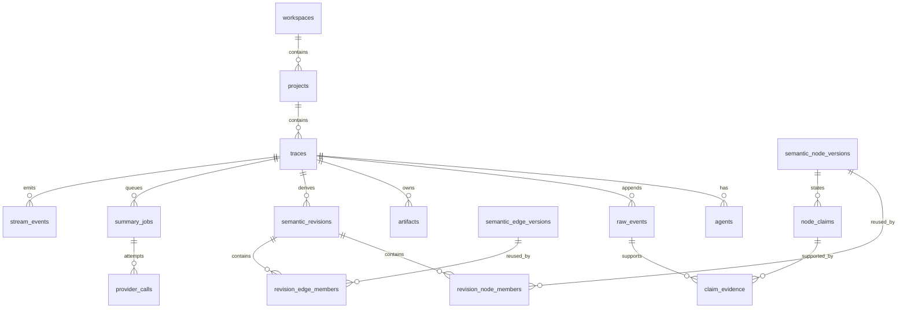

# Database

This document merges the ERD, schema invariants, the migration policy, and retention/deletion rules. `packages/db/src/schema.ts` and the committed migrations are always the source of truth for columns, indexes, FKs, and enums.
Semantic edge versions retain nullable legacy evidence/provenance columns for pre-upgrade rows. New reducer writes always provide non-empty evidence event IDs and provenance; unaudited legacy edges are omitted from graph reads. `topology:rebuild` creates an immutable topology-only revision from existing raw facts without provider calls, preserving historical revisions and pinned node parents.

## Database ERD

_The source document is marked `normative: false`: the diagram below is only a reading aid and does not constitute a normative constraint._

The diagram is only a reading aid; `packages/db/src/schema.ts` and the committed migrations are the source of truth for columns, indexes, FKs, and enums.

## Schema invariants

`raw_events(trace_id, ingest_seq)` and the source identity are unique; a database trigger rejects UPDATE/DELETE on the raw table. `traces.next_ingest_seq` can only be incremented with the row locked inside the ingest transaction. An artifact's hash is unique within a trace.

A revision is unique on trace/branch/sequence; membership is keyed on revision + logical ID, and the version is immutable. A revision's content fields cannot be updated; `stale` is the only permitted lifecycle transition, and the database trigger accepts only `false → true`. A claim ordinal is unique within a node version, and the evidence FK points at a raw event. A summary nonce is unique, and trace + input hash is unique. Stream events use a globally increasing bigint ID, and trace + ID is indexed.

The application MUST additionally verify same-trace ownership, hash format, branch parent, and graph cycles; database constraints are the last line of defence, not a replacement for the reducer. FKs involved in deleting raw/revision rows default to restrict, and are handled in an explicit order only when the trace deletion workflow runs.

## Migration policy

A Drizzle schema change first runs `pnpm db:generate`, then reviews the generated SQL, lock types, defaults, and rollback/recovery impact, and only then commits the schema and the migration. CI runs `drizzle-kit check`; the release path migrates twice against an empty PostgreSQL 18.4, and the second run MUST be a no-op.

A migration MUST NOT be generated implicitly inside the application startup process. Compose uses a one-shot `migrate` service, and the API/worker only start after it succeeds. Destructive changes before productionization use expand → backfill → switch → contract; a large-table backfill MUST be batchable, observable, and interruptible.

Migrations do not promise an automatic down; the recovery strategy is to back up and verify the restore first, then roll out. A migration that has already run in a shared environment is not rewritten, and a correction MUST add a following migration.

## Retention and deletion

The MVP does not automatically expire traces, the outbox, or failed jobs; by default the local operator decides the retention period. Provider request/response bodies are not persisted to the database — only the hash, token/cost, and redaction report are. Automatic retention is deferred until there is stable capacity data, to avoid silently losing replay cursors.

`DELETE /api/v1/traces/:traceId?confirm=:traceId` requires exact ID confirmation; in a single transaction the repository deletes feedback/provider audit/jobs/evidence/membership/versions/outbox/revisions/artifacts/raw/agents/trace in FK order, then calls `ArtifactStore.deleteTrace` to clean up the volume. If the volume cleanup fails, the database deletion has already completed and identifiable orphan files are left behind; the operator retries according to the runbook.

Backups are delayed-deletion copies; complete physical deletion cannot be claimed before the documented backup expiry has passed. Any real user data MUST be anonymized and manually reviewed before it enters a test fixture.
